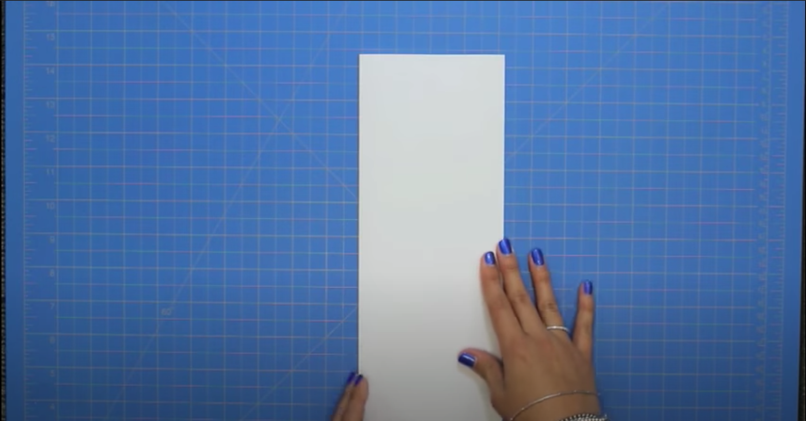
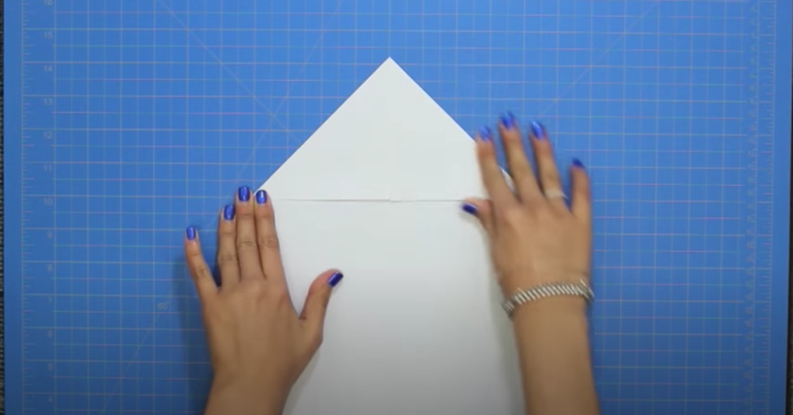
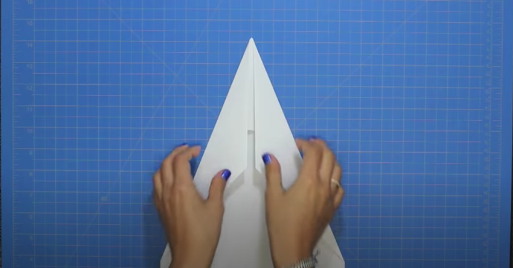
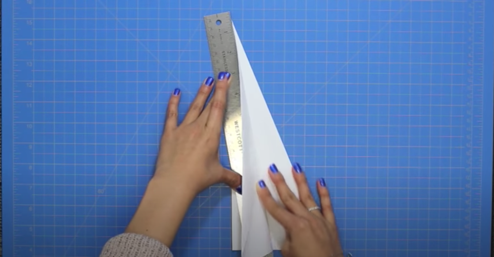
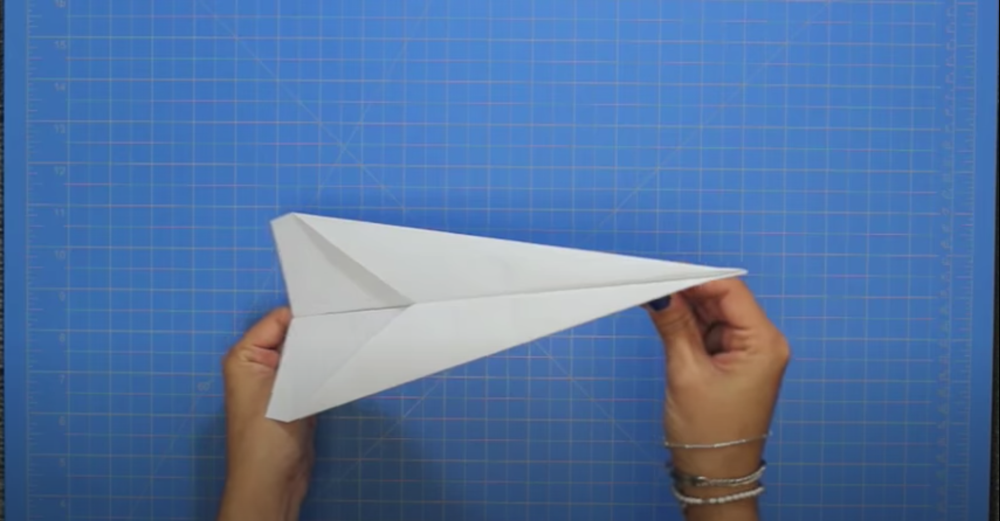

## How to make an amazing Paper Aiplane!

**Overview**

Today you will learn how to make an easy, yet great paper airplane design called the dart. This style of paper airplane is a classic design that also puts in great distance if folded properly and accurately. There are hundreds of other style to choose from, but the dart has the most simplistic design and is best for begineers. You can research and make all the other desgins by clicking this link:

[More Intructions](https://foldnfly.com/#/1-1-1-1-1-1-1-1-2)

**Instructions**

You will need a normal-sized 8.5" by 11" paper and the first step would be to fold it in half vertically, and then open it again so that a vetical line forms down the middle of the page. 

Next, take both top edges of the page and fold them inward so that the meet at the middle line created. Your paper should now look like a square with a triangle on top. 

Once this happens, take the new edge created on either side of the page and fold them into the middle once again, making the page look like a long triangle.

Then, fold the paper in half vertically on the same line we initially made. 

Now that the paper has been folded in half, take the top edge on one side and fold it down, creating one of the wings. 

Flip the paper over and fold the other side to the paper is symetrical. Lastly, open the wings and grip the bottom of the plane, and then throw your airplane as hard as you can!
